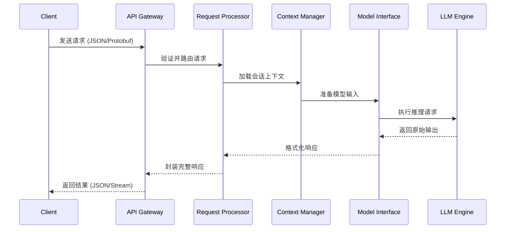

# 深入剖析MCP服务器

## 1. MCP服务器架构解析

### 1.1 什么是MCP

Model Control Protocol (MCP) 是一种专为大型语言模型（LLM）设计的通信协议，它提供了标准化的接口，使开发者能够与各种AI模型进行一致、可靠的交互。MCP服务器则是实现这一协议的核心基础设施。

### 1.2 基础架构组件

MCP服务器的架构通常包含以下核心层次：

#### 1.2.1 前端通信层
- **API网关**：处理所有入站请求，负责请求验证、速率限制、负载均衡
- **WebSocket管理器**：维护长连接，支持流式响应
- **权限认证系统**：验证API密钥、处理OAuth流程

#### 1.2.2 业务逻辑层
- **请求解析器**：将API请求转换为模型可理解的格式
- **提示词处理器**：优化用户输入的提示词
- **上下文管理器**：维护会话历史和状态
- **工具集成系统**：管理函数调用、外部API访问

#### 1.2.3 模型接口层
- **模型路由器**：将请求分发到适当的模型
- **参数优化器**：调整温度、top_p等参数
- **批处理管理器**：优化GPU利用率

#### 1.2.4 资源管理层
- **资源分配器**：优化计算资源使用
- **队列调度器**：管理请求优先级和处理顺序
- **自动扩缩容系统**：根据负载调整资源

## 2. MCP协议内部工作原理

### 2.1 请求-响应生命周期



### 2.2 流式响应机制详解

MCP服务器的流式响应是通过以下步骤实现的：

1. **初始化流**：服务器与客户端建立WebSocket或HTTP长连接
2. **分块生成**：模型生成输出时，将结果分解为小块（通常是token级别）
3. **增量传输**：每生成一小块内容立即发送，不等待完整响应
4. **状态同步**：定期发送元数据，如处理状态和资源使用情况
5. **优雅终止**：完成时发送特定标记，或在错误发生时提供详细信息

流式响应的实现代码示例：

```python
async def stream_response(request, model_interface):
    # 建立流式连接
    response_stream = web.StreamResponse(
        status=200,
        reason='OK',
        headers={'Content-Type': 'text/event-stream'}
    )
    await response_stream.prepare(request)
    
    # 处理模型生成
    async for token in model_interface.generate_streaming(request.prompt):
        # 发送每个生成的token
        await response_stream.write(
            f"data: {json.dumps({'token': token})}\n\n".encode('utf-8')
        )
        await response_stream.drain()
    
    # 发送完成标记
    await response_stream.write(
        b"data: {\"finish_reason\": \"stop\"}\n\n"
    )
    await response_stream.write_eof()
    return response_stream
```

### 2.3 上下文管理与会话处理

MCP服务器需要高效管理对话历史：

1. **上下文窗口滑动**：当对话超出模型最大上下文窗口时，使用滑动窗口技术保留最相关信息
2. **语义压缩**：使用额外模型对长对话进行压缩，提取关键信息
3. **记忆管理**：区分短期和长期记忆，智能决定何时引入历史信息
4. **会话状态持久化**：使用Redis或类似存储保存会话状态，实现跨请求的上下文延续

上下文管理器架构：

```
ConversationManager
├── MessageHistory
│   ├── UserMessages[]
│   └── AssistantMessages[]
├── ContextWindow
│   ├── size: int
│   ├── current_tokens: int
│   └── sliding_algorithm: Enum
├── StateManager
│   ├── conversation_state: Dict
│   ├── tool_states: Dict
│   └── persist(): void
└── TokenCounter
    └── estimate_tokens(text): int
```

## 3. MCP服务器与Claude交互实例

### 3.1 Claude API交互流程

以下是MCP服务器与Claude交互的典型流程及示例代码：

```python
import anthropic
import json
from fastapi import FastAPI, Request
from fastapi.responses import StreamingResponse
import asyncio

app = FastAPI()
client = anthropic.Anthropic(api_key="your_api_key")

@app.post("/v1/chat")
async def chat_endpoint(request: Request):
    # 解析请求
    data = await request.json()
    messages = data.get("messages", [])
    stream = data.get("stream", False)
    
    # 准备Claude请求参数
    claude_messages = []
    for msg in messages:
        claude_messages.append({
            "role": msg["role"],
            "content": msg["content"]
        })
    
    # 处理工具调用
    tools = data.get("tools", [])
    claude_tools = None
    if tools:
        claude_tools = tools
    
    # 处理流式响应
    if stream:
        return StreamingResponse(
            stream_claude_response(claude_messages, claude_tools),
            media_type="text/event-stream"
        )
    
    # 处理标准响应
    response = client.messages.create(
        model="claude-3-opus-20240229",
        messages=claude_messages,
        tools=claude_tools,
        max_tokens=data.get("max_tokens", 1024),
        temperature=data.get("temperature", 0.7)
    )
    
    return response.json()

async def stream_claude_response(messages, tools=None):
    with client.messages.stream(
        model="claude-3-opus-20240229",
        messages=messages,
        tools=tools,
        max_tokens=1024
    ) as stream:
        for chunk in stream:
            if chunk.type == "content_block_delta":
                yield f"data: {json.dumps({'delta': {'content': chunk.delta.text}})}\n\n"
            elif chunk.type == "message_stop":
                yield f"data: {json.dumps({'finish_reason': 'stop'})}\n\n"
```

### 3.2 工具调用与函数执行

Claude和其他现代LLM支持工具调用，MCP服务器管理这一过程：

1. **工具注册**：在服务器启动时注册可用工具及其JSON Schema
2. **工具选择**：模型决定调用哪个工具及参数
3. **函数执行**：服务器执行函数并捕获结果
4. **结果整合**：将执行结果返回给模型，模型利用这些信息继续对话

工具调用实现示例：

```python
# 工具定义
tools = [
    {
        "type": "function",
        "function": {
            "name": "get_weather",
            "description": "获取指定城市的当前天气",
            "parameters": {
                "type": "object",
                "properties": {
                    "location": {
                        "type": "string",
                        "description": "城市名称，如北京、上海"
                    },
                    "unit": {
                        "type": "string",
                        "enum": ["celsius", "fahrenheit"],
                        "description": "温度单位"
                    }
                },
                "required": ["location"]
            }
        }
    }
]

# 工具实现
async def execute_tool(tool_name, parameters):
    if tool_name == "get_weather":
        location = parameters.get("location")
        unit = parameters.get("unit", "celsius")
        # 调用实际的天气API
        weather_data = await call_weather_api(location, unit)
        return weather_data
    else:
        raise ValueError(f"Unknown tool: {tool_name}")

# 工具调用逻辑
async def handle_tool_calls(tool_calls):
    results = []
    for tool_call in tool_calls:
        function = tool_call.function
        result = await execute_tool(
            function.name,
            json.loads(function.arguments)
        )
        results.append({
            "tool_call_id": tool_call.id,
            "output": json.dumps(result)
        })
    return results
```

### 3.3 实时性能监控与优化

MCP服务器运行时性能监控至关重要：

1. **延迟追踪**：记录请求从接收到响应的完整生命周期
2. **吞吐量监控**：追踪每秒请求数和响应生成速率
3. **资源利用率**：监控GPU/CPU使用情况、内存占用
4. **队列长度**：衡量请求积压情况
5. **错误率**：追踪各类错误及其频率

性能数据收集示例：

```python
class PerformanceMonitor:
    def __init__(self):
        self.metrics = {
            "request_count": 0,
            "total_latency": 0,
            "error_count": 0,
            "token_count": 0,
            "queue_length": 0
        }
        self.detailed_latencies = {
            "authentication": [],
            "queue_wait": [],
            "context_preparation": [],
            "model_inference": [],
            "response_formatting": []
        }
    
    async def track_request(self, request_id):
        start_time = time.time()
        request_data = {
            "id": request_id,
            "start_time": start_time,
            "stages": {}
        }
        self.active_requests[request_id] = request_data
        return request_data
    
    def record_stage(self, request_id, stage_name, duration):
        if request_id in self.active_requests:
            self.active_requests[request_id]["stages"][stage_name] = duration
            self.detailed_latencies[stage_name].append(duration)
    
    def complete_request(self, request_id, success=True, token_count=0):
        if request_id in self.active_requests:
            request_data = self.active_requests.pop(request_id)
            end_time = time.time()
            total_time = end_time - request_data["start_time"]
            
            self.metrics["request_count"] += 1
            self.metrics["total_latency"] += total_time
            self.metrics["token_count"] += token_count
            
            if not success:
                self.metrics["error_count"] += 1
            
            return total_time
```

## 4. 典型MCP服务器实现及对比

### 4.1 开源MCP服务器实现

1. **vLLM**
   - **特点**：高吞吐量、连续批处理、PagedAttention技术
   - **优势**：内存效率高，适合服务多模型
   - **劣势**：配置较复杂，自定义功能开发有一定门槛

2. **Text Generation Inference (TGI)**
   - **特点**：HuggingFace开发，强调易用性和兼容性
   - **优势**：与Transformers生态紧密集成，部署简单
   - **劣势**：在某些场景下性能不如专门优化的解决方案

3. **Triton Inference Server**
   - **特点**：NVIDIA开发，支持多种模型格式
   - **优势**：GPU优化出色，企业级可靠性
   - **劣势**：LLM特定功能需要额外配置

### 4.2 云服务提供商MCP实现

1. **Anthropic Claude API**
   - **架构特点**：强调安全性、可控性和高质量输出
   - **接口设计**：简洁的Messages API，丰富的控制参数
   - **流式处理**：支持增量内容和思考过程可视化
   - **示例**：
     ```python
     from anthropic import Anthropic
     
     client = Anthropic(api_key="your_api_key")
     message = client.messages.create(
         model="claude-3-opus-20240229",
         max_tokens=1000,
         messages=[
             {"role": "user", "content": "分析人工智能在医疗领域的应用前景"}
         ],
         system="你是一位人工智能和医疗领域的专家。给出详细、专业的分析。"
     )
     ```

2. **OpenAI API**
   - **架构特点**：统一的Chat Completions API，支持多模型
   - **接口设计**：基于消息列表的对话模型
   - **流式处理**：SSE流式传输支持
   - **示例**：
     ```python
     from openai import OpenAI
     
     client = OpenAI(api_key="your_api_key")
     response = client.chat.completions.create(
         model="gpt-4",
         messages=[
             {"role": "system", "content": "你是一位专业助手。"},
             {"role": "user", "content": "编写一个快速排序算法。"}
         ],
         temperature=0.7
     )
     ```

## 5. MCP高级功能与优化

### 5.1 向量存储与RAG集成

现代MCP服务器通常集成检索增强生成(RAG)功能：

1. **知识库管理**：向量数据库(如Pinecone、Weaviate)集成
2. **动态检索**：根据用户查询智能获取相关文档
3. **上下文增强**：将检索到的信息合并到提示中

RAG集成示例代码：

```python
from langchain_community.vectorstores import Pinecone
from langchain.embeddings import OpenAIEmbeddings
import pinecone

# 初始化向量存储
pinecone.init(api_key="pinecone_api_key", environment="environment")
embeddings = OpenAIEmbeddings(api_key="openai_api_key")
vectorstore = Pinecone.from_existing_index("index_name", embeddings)

async def enhance_prompt_with_rag(user_query, max_documents=3):
    # 从向量数据库检索相关文档
    documents = vectorstore.similarity_search(user_query, k=max_documents)
    
    # 提取文本内容
    context_texts = [doc.page_content for doc in documents]
    
    # 构建增强上下文
    enhanced_context = "以下是可能相关的信息：\n\n" + "\n\n".join(context_texts)
    
    # 返回增强后的提示
    return {
        "original_query": user_query,
        "enhanced_context": enhanced_context,
        "source_documents": [{"id": doc.metadata.get("id"), "source": doc.metadata.get("source")} for doc in documents]
    }
```

### 5.2 多模型路由与混合推理

高级MCP服务器支持多模型协作：

1. **智能模型选择**：根据查询复杂性和成本自动选择合适模型
2. **混合推理**：将问题分解，使用不同模型处理各部分
3. **结果合成**：整合多个模型的输出生成最终答案

多模型路由器示例：

```python
class ModelRouter:
    def __init__(self):
        self.models = {
            "fast": {
                "client": create_client("claude-3-haiku"),
                "cost_per_1k_tokens": 0.25,
                "capabilities": ["general_qa", "summarization", "classification"]
            },
            "balanced": {
                "client": create_client("claude-3-sonnet"),
                "cost_per_1k_tokens": 3.00,
                "capabilities": ["general_qa", "summarization", "complex_reasoning", "code_generation"]
            },
            "powerful": {
                "client": create_client("claude-3-opus"),
                "cost_per_1k_tokens": 15.00,
                "capabilities": ["general_qa", "summarization", "complex_reasoning", "code_generation", "creative_writing"]
            }
        }
        
        # 加载查询分类器模型
        self.query_classifier = load_classifier_model()
    
    async def route_query(self, query, user_preferences=None):
        # 分析查询类型和复杂度
        query_analysis = await self.analyze_query(query)
        query_type = query_analysis["type"]
        complexity = query_analysis["complexity"]
        
        # 考虑用户偏好
        if user_preferences and "preferred_model" in user_preferences:
            return self.models[user_preferences["preferred_model"]]
        
        # 根据类型和复杂度路由
        if complexity > 0.8 or query_type in ["creative_writing", "complex_reasoning"]:
            return self.models["powerful"]
        elif complexity > 0.4 or query_type in ["code_generation"]:
            return self.models["balanced"]
        else:
            return self.models["fast"]
    
    async def analyze_query(self, query):
        # 使用轻量级模型分析查询
        features = extract_features(query)
        query_type = self.query_classifier.predict_type(features)
        complexity = self.query_classifier.predict_complexity(features)
        
        return {
            "type": query_type,
            "complexity": complexity,
            "token_estimate": len(query.split()) // 4 * 3  # 粗略估计
        }
```

### 5.3 安全与内容过滤

MCP服务器实现全面的安全保障措施：

1. **输入过滤**：检测并阻止有害提示，如提示注入攻击
2. **输出过滤**：检查模型输出，防止有害内容生成
3. **安全分类器**：使用专门模型识别违规内容
4. **行为监控**：追踪异常使用模式和滥用行为

安全中间件示例：

```python
class SecurityMiddleware:
    def __init__(self):
        # 加载内容安全分类器
        self.content_classifier = load_safety_classifier()
        
        # 定义敏感话题和封禁模式
        self.sensitive_patterns = load_patterns_from_config()
        self.blocklist = load_blocklist_from_db()
        
        # 记录器
        self.security_logger = setup_security_logger()
    
    async def check_input(self, user_id, prompt, context=None):
        # 基础安全检查
        prompt_security_score = self.content_classifier.classify(prompt)
        
        # 提示注入检测
        injection_score = await self.detect_prompt_injection(prompt)
        
        # 用户行为检查
        user_risk_score = await self.get_user_risk_score(user_id)
        
        # 安全决策
        if prompt_security_score > 0.8 or injection_score > 0.7:
            self.security_logger.warning(f"Blocked high-risk prompt from user {user_id}")
            return {
                "allowed": False,
                "reason": "Content policy violation",
                "recommendation": "Please review our content guidelines."
            }
        
        if user_risk_score > 0.9:
            self.security_logger.warning(f"Blocked prompt from high-risk user {user_id}")
            return {
                "allowed": False,
                "reason": "Account restriction",
                "recommendation": "Please contact support."
            }
        
        # 允许但可能需要监控
        return {
            "allowed": True,
            "risk_level": max(prompt_security_score, injection_score, user_risk_score),
            "needs_review": prompt_security_score > 0.5
        }
    
    async def check_output(self, content, prompt=None):
        # 内容安全分析
        content_risk = self.content_classifier.classify(content)
        
        # 内容替换或过滤
        if content_risk > 0.9:
            return {
                "allowed": False,
                "filtered_content": "[Content removed due to safety policy]"
            }
        
        if content_risk > 0.7:
            # 部分内容需要替换
            filtered_content = self.redact_sensitive_parts(content)
            return {
                "allowed": True,
                "filtered_content": filtered_content,
                "was_modified": True
            }
        
        return {
            "allowed": True,
            "filtered_content": content,
            "was_modified": False
        }
```

## 6. 未来发展趋势

### 6.1 多模态MCP协议扩展

未来MCP服务器将扩展到支持多模态交互：

1. **统一表示**：开发标准化的多模态内容表示
2. **跨模态上下文**：维护图像、文本、音频等多种模态的上下文
3. **智能路由**：根据内容类型选择最合适的模型或模型组合

多模态MCP示例：

```python
# 多模态消息结构
multimodal_message = {
    "role": "user",
    "content": [
        {
            "type": "text",
            "text": "这张图片中有什么问题？"
        },
        {
            "type": "image",
            "image_url": {
                "url": "https://example.com/image.jpg"
            }
        }
    ]
}

# 多模态处理器
class MultimodalProcessor:
    def __init__(self):
        self.text_encoder = load_text_encoder()
        self.image_encoder = load_image_encoder()
        self.audio_encoder = load_audio_encoder()
        
    async def process_content(self, content_items):
        processed_items = []
        
        for item in content_items:
            if item["type"] == "text":
                encoded_text = await self.text_encoder.encode(item["text"])
                processed_items.append({
                    "type": "text_embedding",
                    "embedding": encoded_text,
                    "original": item["text"]
                })
            elif item["type"] == "image":
                image_data = await download_image(item["image_url"]["url"])
                encoded_image = await self.image_encoder.encode(image_data)
                processed_items.append({
                    "type": "image_embedding",
                    "embedding": encoded_image,
                    "metadata": {
                        "width": image_data.width,
                        "height": image_data.height,
                        "format": image_data.format
                    }
                })
            # 处理其他模态...
            
        return processed_items
```

### 6.2 分布式MCP服务架构

大规模MCP服务架构正向更复杂的分布式系统演进：

1. **服务网格**：使用Istio等技术管理微服务通信
2. **边缘计算整合**：将部分处理下放到边缘节点减少延迟
3. **全球分布式推理**：跨地理位置部署模型副本
4. **弹性设计**：实现高可用性和故障恢复

分布式架构组件示例：

```
MCP分布式架构
├── 边缘层
│   ├── 请求路由器
│   ├── 内容缓存
│   └── 初步分析处理
├── 协调层
│   ├── 服务注册与发现
│   ├── 负载均衡器
│   └── 故障检测器
├── 处理层
│   ├── 请求处理集群
│   ├── 上下文管理服务
│   └── 功能调用协调器
├── 模型层
│   ├── 小型模型池(低延迟)
│   ├── 中型模型池(平衡型)
│   └── 大型模型池(高能力)
└── 存储层
    ├── 会话状态存储
    ├── 向量数据库集群
    └── 监控与日志存储
```

### 6.3 智能资源调度与优化

下一代MCP服务器将实现智能资源管理：

1. **预测性缩放**：分析历史模式预测负载变化
2. **模型蒸馏部署**：根据复杂度动态选择全尺寸或蒸馏模型
3. **混合精度推理**：根据需求平衡精度和性能
4. **专家路由系统**：将查询定向到专门领域的模型

预测性资源管理器示例：

```python
class PredictiveResourceManager:
    def __init__(self):
        self.load_predictor = train_load_prediction_model()
        self.resource_optimizer = load_resource_optimizer()
        self.current_resources = {
            "small_instances": 5,
            "medium_instances": 3,
            "large_instances": 2
        }
    
    async def predict_and_adjust(self, look_ahead_minutes=15):
        # 收集当前指标
        current_metrics = await collect_system_metrics()
        
        # 预测未来负载
        predicted_load = self.load_predictor.predict(
            current_metrics, 
            minutes=look_ahead_minutes
        )
        
        # 计算理想资源配置
        ideal_resources = self.resource_optimizer.calculate_resources(
            predicted_load,
            cost_sensitivity=self.current_cost_sensitivity
        )
        
        # 确定扩缩计划
        scaling_plan = self.determine_scaling_actions(
            self.current_resources,
            ideal_resources
        )
        
        # 执行扩缩
        if scaling_plan["actions"]:
            await self.execute_scaling(scaling_plan["actions"])
            self.current_resources = scaling_plan["new_resources"]
            
        return {
            "current_load": current_metrics["load"],
            "predicted_load": predicted_load,
            "current_resources": self.current_resources,
            "scaling_actions": scaling_plan["actions"]
        }
```

## 7. 总结

MCP服务器代表了AI服务基础设施的重要发展方向，它将复杂的大语言模型能力封装为标准化、高性能的API服务。随着模型能力的增强和应用场景的扩展，MCP服务器架构也在不断演进，支持多模态交互、更智能的资源管理和更复杂的分布式部署。

通过深入理解MCP服务器的内部原理，开发者可以更有效地利用和扩展这些服务，构建下一代AI应用。

---

_本文档将根据MCP服务器技术的发展持续更新。_